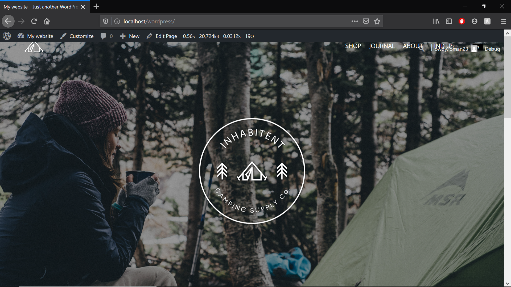

# Inhabitent Camping Store and Blog

A project using Wordpress code and servers, to create and elaborate a website wich contains a blog, a shop area and info about the camping website.

## Learnings

Learned about how to use and work around wordpress code wich main language is PHP, learned about their pages and their respective hierarchy, learned about the user friendly admin area and database to create my own websites and custom themes.

### Tools used

- MAMP servers
- Wordpress
- Wordpress Plugins
- VS Code
- Git Bash

## INSTALL

* Clone the git repository — `git clone
  https://github.com/OM-AN27/Instanews.git`  

  * Install `npm` on master folder

* Run `gulp` on the git bash 

 ## Plugins 

 Some plugins are being ignored, so make sure to install and activate:

 * Contact Form 7
 * Akismet  (Akismet checks your comments and contact form submissions against our global database of spam to protect you and your site from malicious content.).

